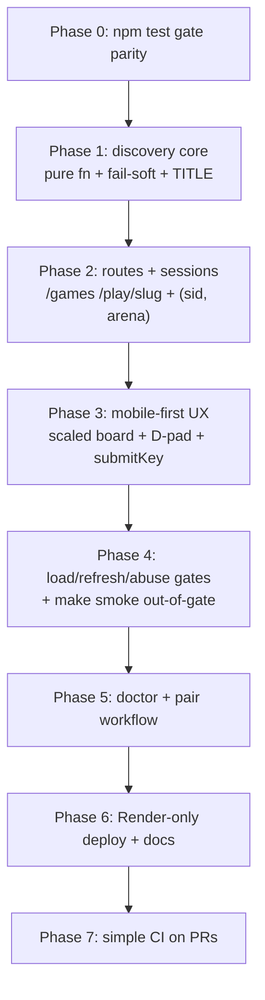

# Class Arcade Plan — arena folders + `/games` menu + mobile-first UX

_Companion to [`quarter2_oop_github_plan.md`](quarter2_oop_github_plan.md) §7. Decisions locked in discussion: auto-scan + fail-soft discovery; `/` stays the starter game, menu at `/games`, play at `/play/<slug>`; `GAME_CONFIG_MODULE` stays as dev/demo override; each arena declares `TITLE`; PythonAnywhere retired in favor of Render + GitHub Sync-fork; zip kept for Workshop 01 only. Review-ledger rulings (resolved): R1 `submitKey` + `_busy` race fix approved; R3 `arenas/sample_pair/` ships; R4 zip kept for Workshop 01; R5 simple CI is IN scope._

**Executor note:** sized for gpt6-luna / glm5.3-flash agents — every task names exact files, the gate tests to write FIRST (tests-as-spec doctrine from [`../inceptions/context.md`](../inceptions/context.md)), and a done-criteria. No task depends on information outside this repo.

---

## 0) How correctness is known (answering "how do we know the plan works?")

1. **Tests-as-spec, phase-gated.** Every task writes its gate tests first; a phase is done only when `npm test` exits 0 (see Task 0.1 — `npm test` becomes full-gate parity with `make test`: pytest + node --test).
2. **The load/refresh/abuse smoke suite** (Phase 4) is the automated equivalent of "pages worked on load and refresh; empty inputs and double submits are handled":
   - *load* → `/` and `/play/<slug>` render 200 with `__INITIAL_STATE__` embedded (extends [`test_index_embeds_initial_state_for_first_paint`](../tests/test_app.py));
   - *refresh* → second GET embeds the CURRENT engine state, and GET routes never mutate state;
   - *empty inputs* → `/api/step` with `{}`, `{"key": ""}`, malformed JSON — in starter AND arena contexts;
   - *double submits* → double `/api/reset` idempotent; double-tap on touch controls fires exactly ONE `POST /api/step` (in-flight guard).
3. **Out-of-gate live smoke**: `make smoke` boots a real server and probes `/`, `/games`, `/play/<slug>` — deliberately OUTSIDE `make test` so process/port flakiness can never break the gate.
4. **Pixels stay manual** (existing doctrine): the README 8-point visual checklist gains 3 mobile points (§3.5).
5. **Score bar**: every in-gate task lands at **≥92% feasibility AND confidence** after simplification; anything that started ≤90% is listed in the Review Ledger (§R) with the simplification applied. All ledger rulings are resolved — no open decisions remain.

### Score rubric
- **Feasibility %** — probability the assigned agent completes the task to a green gate with zero human help, given this plan and repo conventions.
- **Confidence %** — probability that a green gate implies the feature is actually correct in production (test strength vs. hidden gaps like pixels, fonts, timing).

### Mermaid — phase flow



---

## Phase 0 — Gate parity: `npm test` (F96 C95)

**T0.1 — package.json scripts + drift guard.**
- `package.json`: add `"scripts": { "test:py": "venv/bin/pytest -q tests/", "test:js": "node --test tests/js/", "test": "npm run test:py && npm run test:js" }`. (`node --test tests/js/` directory form — no shell glob, works everywhere Node ≥20.)
- New `tests/test_gate_parity.py`: asserts package.json has `test` referencing both halves, and that the JS test dir exists. Prevents the two entries from drifting apart.
- Files: `package.json`, `tests/test_gate_parity.py`. **Done:** `npm test` == `make test` result; both green.
- Tradeoffs — DX: one command for humans; AX: agents universally try `npm test` first. UX: unaffected.

---

## Phase 1 — Arena discovery core (pure Python, no HTTP)

**T1.1 — `rogue_edu/arenas/` package + `discover_arenas(base)` (F97 C96)**
- `rogue_edu/arenas/__init__.py` exposes `discover_arenas(base: Path) -> list[ArenaInfo]`; `ArenaInfo` dataclass: `slug`, `title`, `ok`, `error`.
- Scan rules: only immediate subdirs; skip `_`-prefixed (template, `__pycache__`); slug must match `[a-z0-9_]+`; requires `game_config.py` inside.
- `app.py` gains module-level `ARENAS_BASE = Path(__file__).resolve().parent / "arenas"` — the ONE seam tests monkeypatch to a `tmp_path`. Discovery itself is pure → deterministic, no server.
- Gate `tests/test_discovery.py`: finds valid arena; skips `_template`, `__pycache__`, bad-slug dirs; sorts by title.

**T1.2 — Fail-soft contract (F96 C95)**
- Per folder: `importlib.import_module(f"arenas.{slug}.game_config")` inside try/except; then verify `create_game` callable; then `create_game()` once inside try/except (a config that imports but explodes at build time is still "broken").
- Any failure → `ok=False`, `error` = short human summary (`{ExcType}: first 120 chars`). NEVER raises out of `discover_arenas`.
- Gate: fixture-driven — syntax-error config, import-crash config, missing `create_game`, raising `create_game` (reuse the spirit of [`tests/fixtures/`](../tests/fixtures) broken-checker fixtures).

**T1.3 — TITLE contract (F97 C96)**
- `TITLE: str` module attribute; missing/non-str → fallback `slug.replace("_", " ").title()` (fail-soft, never a crash).
- Gate: TITLE present → used; missing → fallback; wrong type → fallback.

---

## Phase 2 — Routes + session keying

**T2.1 — `GET /games` + `games.html` (F95 C94)**
- Bulma `columns is-multiline` card grid: one card per arena — green `ok` cards link `/play/<slug>`; broken cards are non-link "needs fixing" cards showing the error summary (a teaching artifact: students see their prod failure, not a mystery).
- A persistent first card: **Starter** → links `/` (which clears the arena choice). Demos stay env-var-only (decided).
- App exposes `discover_arenas(app.ARENAS_BASE)` per request (cheap `os.listdir` at classroom scale; `importlib` caching is fine — Render restarts on every merge anyway).
- Gate `tests/test_games_route.py` (monkeypatched tmp arenas): 200; contains TITLE; broken arena renders a disabled card; **ALL arenas broken → menu still 200** (the fail-soft headline test).

**T2.2 — `GET /play/<slug>` (F95 C94)**
- Valid + healthy slug → `session["arena"] = slug`, render [`index.html`](../rogue_edu/templates/index.html) with THAT arena's `payload()` (board paints on load — same contract as `/`).
- Unknown slug → 404. Known but `ok=False` → friendly "this arena needs fixing" page (200) with the error + link back to `/games`.
- Gate: three cases above + asserts embedded payload belongs to the chosen arena (distinct hero name).

**T2.3 — Session keying `(sid, arena)` (F96 C95)**
- [`GAMES`](../rogue_edu/app.py) keys become `(session_id, arena)` where arena is `""` for the starter. `_get_game()`/`step`/`reset` resolve the factory from `session.get("arena")`.
- `/` **clears** `session["arena"]` → the starter game, per the locked route decision.
- `GAME_CONFIG_MODULE` still governs the starter factory when no arena is chosen → existing golden/env tests stay untouched and green.
- Gate: two test clients × two arenas never cross-contaminate (extend [`test_browser_sessions_have_independent_games`](../tests/test_app.py) pattern); `/play/x` then `/` then step → starter hero.

**T2.4 — step/reset arena-aware + double-submit idempotency (F97 C96)**
- `/api/step` and `/api/reset` use the session arena's factory; reset re-runs the right `create_game()`.
- Gate: double reset → turn 0 both times, same hero; step storm of 10 rapid posts → turn == number of accepted steps, state consistent.

---

## Phase 3 — Mobile-first UX (the 70% phone audience)

Grounding: [`index.html`](../rogue_edu/templates/index.html) already has the viewport meta and Bulma columns (which stack on narrow screens by default). The two real gaps: the canvas is a **fixed 500×500** (overflows a 360–414px phone), and input is **keyboard-only** (WASD does not exist on a phone).

**T3.1 — Scaled board (F96 C94)**
- CSS: `#board { max-width: 100%; height: auto; }` — canvas keeps its 500×500 internal resolution (no renderer change; [`renderBoard`](../rogue_edu/static/game.js) math untouched), CSS scales it down. `image-rendering: pixelated` preserved.
- Structural gate in `test_frontend_structure.py` asserts the rule exists (matching house doctrine — pixels stay manual).
- **README checklist +3 mobile points:** board fits a 360px viewport; D-pad visible and tappable under the board; `/games` cards are single-column on a phone.

**T3.2 — On-screen D-pad (F94 C93)**
- Template adds a 5-button D-pad (◀ ▶ ▲ ▼ + Wait), `aria-label`ed, ≥44px tap targets, shown only under `@media (pointer: coarse), (max-width: 768px)` — hidden for desktop keyboard users.
- Buttons dispatch `new KeyboardEvent("keydown", { key: "w" | ... })` on `document` — zero dispatch logic of their own; they ride the existing listener in [`boot()`](../rogue_edu/static/game.js).
- Gate: structural test asserts button ids + the media query; jsdom test asserts a dispatched synthetic event reaches the handler seam (see T3.3).

**T3.3 — `submitKey` seam + in-flight guard (F92 C92 — riskiest task; pre-simplified, see §R1)**
- Refactor: extract the body of the keydown handler into exported `submitKey(key)`; `boot()` keeps only `ev` → key mapping and calls it. Add `_busy` flag: while a POST is in flight, further keys are DROPPED (cleared in `.finally`). This also **fixes a latent production race**: today, key spam fires concurrent `POST /api/step`s against the same engine (gunicorn runs 4 threads — real interleaving).
- Update the structural gate [`test_game_js_has_no_fetch_outside_boot_path`](../tests/test_frontend_structure.py): pure section now ends at `function update(` (fetch lives in `submitKey`, called only from boot's wiring).
- jsdom gate with a mocked `global.fetch`: double-tap → exactly 1 POST; response calls `update`; game_over payload locks input (`handleKey` already gates — now also `_busy`).
- **Simplification fallback if it stalls in review:** ship T3.2 synthetic-events only, no `_busy` (→ F96 C94) — but the race stays. Recommend the fix.

---

## Phase 4 — Load / refresh / abuse smoke gates

**T4.1 — Flask load/refresh (F97 C96)**
- GET `/play/<slug>` twice → both 200; second response embeds CURRENT state (progress survives refresh); GETs never advance the turn.
- Gate: step to turn 2, re-GET, assert embedded `turn == 2`; assert turn unchanged by any GET.

**T4.2 — jsdom render idempotency (F96 C95)** — the refresh-equivalent at the JS layer
- jsdom has no 2D canvas, so [`boot()`](../rogue_edu/static/game.js) exits early there (by design) — the honest automated proxy is render idempotency: call `renderLogs` / `updateHud` / `updateDialogue` twice with the same payload → no ghost rows, HUD correct once (all three are exported/stub-context-testable already).
- Gate in `tests/js/renderer.test.js` style.

**T4.3 — Abuse suite (F95 C94)**
- Extend `test_missing_key_is_handled_gracefully` patterns into arena contexts: `{}`, `{"key": ""}`, malformed JSON body, unknown key — against a session playing an arena. Plus: reset interleaved mid-step-sequence.
- Gate `tests/test_abuse.py`: every probe returns a well-formed contract payload (validated against [`turn_payload_schema.json`](../tests/fixtures/turn_payload_schema.json)), never a 500.

**T4.4 — `make smoke` live-server probe (F92 C91 — out-of-gate BY DESIGN, see §R2)**
- `tools/smoke_deploy.py`: boots `gunicorn --chdir rogue_edu app:app` (or `flask run`) on an ephemeral port, probes `/`, `/games`, `/play/<slug>`, one real step POST, asserts 200 + key markers, terminates. Wired as `make smoke`.
- Lives in `tools/` → pytest never collects it → it CANNOT flake the gate. Run before deploys / after Render merges.

---

## Phase 5 — Doctor + pair workflow

**T5.1 — Doctor CLI target (F95 C94)**
- [`check_my_class.py`](../rogue_edu/check_my_class.py): `python check_my_class.py [module_or_path]` — accepts a dotted module (`arenas.ada_and_ivo.classes`) OR a file path (mapped to the dotted form); default stays `student_starter.classes` → zero golden drift.
- Also WARN if the arena's `game_config.py` lacks `TITLE`.
- Gate: existing checker fixtures keep passing; new fixture pair folder checks out.

**T5.2 — Pair recipe + template (F96 C95)**
- `rogue_edu/arenas/README.md`: the copy-paste recipe (copy `_template/` → rename → edit `TITLE` + `create_game()` → doctor PASS → branch/commit/PR).
- `rogue_edu/arenas/_template/`: `__init__.py`, `classes.py`, `game_config.py` with TODOs — skipped by discovery via the `_` prefix rule (tested in T1.1).
- Ship one `arenas/sample_pair/` worked example — a tiny twist on the starter (different hero name, one extra villain, `TITLE = "Sample Pair — Example Arena"`) — so the menu is not empty pre-class and students see a concrete PR-shaped folder to copy. _[R3 ruling: confirmed ship it.]_

---

## Phase 6 — Render-only deploy + docs cascade

**T6.1 — DEPLOYING.md Render-only + gate rewrite (F96 C95)**
- Rewrite [`DEPLOYING.md`](../DEPLOYING.md): fork → Render push-to-deploy → Sync fork → auto-redeploy; `SECRET_KEY`; the sleep fact; `--workers 1` warning. Drop PythonAnywhere.
- Rewrite [`test_deploying_doc_covers_both_platforms`](../tests/test_deploy.py) → `test_deploying_doc_covers_render_workflow`: asserts `render`, `sync fork`, `secret_key`, `sleep`, `--workers 1`; asserts **not** `pythonanywhere`.

**T6.2 — Packaging: zip kept for Workshop 01 only (F94 C93 — resolved per §R4)**

- Ruled: keep `make zip` for Workshop 01's Windows on-ramp ONLY, and have [`tools/package_workshop.py`](../tools/package_workshop.py) ship the `arenas/` scaffold (`_template/` + README + `sample_pair/`, no student folders). Update [`test_packaging.py`](../tests/test_packaging.py) selection lists to match. _Confidence raised from C92: the decision space is closed._

**T6.3 — Docs cascade (F98 C97)**
- [`quarter2_oop_github_plan.md`](quarter2_oop_github_plan.md) §7: rewrite from `cast/` shared-config files to per-pair arena folders + the menu; §5/6 mention `/games` in the money moment.
- [`TEACHER_GUIDE.md`](TEACHER_GUIDE.md): menu section, broken-card triage workflow ("your card is yellow → read the error → fix → PR").
- [`../inceptions/context.md`](../inceptions/context.md): deployment track rewritten (Render-only), new arcade decisions recorded.

---

## Phase 7 — Simple CI on PRs (IN SCOPE per §R5 ruling)

**T7.1 — `.github/workflows/tests.yml` (F94 C93 — simplified from F90 C90)**

The three drift risks that scored it 90/90 were (a) custom inline shell, (b) unpinned toolchains, (c) no lockfile. All three are removed:

- **One run step.** CI executes exactly `make test` — the gate already encapsulates venv + pytest + node, so the workflow carries ZERO logic of its own to drift.
- **Pinned, first-party actions only:** `actions/checkout@v4`, `actions/setup-python@v5` with `python-version: '3.14'` (pinned to the dev machine), `actions/setup-node@v4` with `node-version: 24` (the `node --test tests/js/` directory form needs ≥20).
- **Lockfile:** commit `package-lock.json` (one local `npm install`, part of this task) so CI runs `npm ci` — deterministic jsdom, no floating `^30.1.0`.
- **Triggers:** every `pull_request` (the student red/green X — automates §8 caution #2) plus `push` to `main` only (no duplicate runs on student branches).

Verbatim workflow — the implementing agent may copy this as-is:

```yaml
name: tests
on:
  pull_request:
  push:
    branches: [main]
jobs:
  gate:
    runs-on: ubuntu-latest
    steps:
      - uses: actions/checkout@v4
      - uses: actions/setup-python@v5
        with:
          python-version: '3.14'
      - run: python -m venv venv && venv/bin/pip install -r requirements.txt
      - uses: actions/setup-node@v4
        with:
          node-version: 24
      - run: npm ci
      - run: make test
```

- Structural drift gate `tests/test_ci.py`: workflow file exists, triggers on `pull_request`, contains `make test`, uses `npm ci` (same house doctrine as [`test_frontend_structure.py`](../tests/test_frontend_structure.py)).
- Residual risks, accepted: Actions must be enabled on the section repo (default for public repos; free minutes are ample at classroom scale); runner/network flakes surface as re-runs, never as false-green merges — the teacher merges only on green.

---

## R) Review Ledger — every task that scored ≤90, and the simplification

| # | Item | First score | Problem | Simplification applied | Final |
| --- | --- | --- | --- | --- | --- |
| R1 | T3.3 touch input refactor | F88 C86 | touching the working input path; handler unreachable under jsdom | extract ONE exported `submitKey` seam; `_busy` guard drops in-flight duplicates; structural gate UPDATED not deleted; jsdom via mocked `global.fetch` | **F92 C92** — APPROVED as designed |
| R2 | T4.4 live-server smoke | F85 C84 | subprocess/port flakiness inside the gate would break `make test` | moved OUT of the gate → `make smoke` dev script in `tools/`, 3 GETs + 1 POST only | **F92 C91** out-of-gate |
| R3 | sample arena in `arenas/` | F90 C88 | a shipped example could confuse real pairs / pollute the menu | RULED: ship `sample_pair/` as the worked example (see T5.2) | **F96 C95** — decision closed |
| R4 | zip fate | F94 C92 | retiring the zip orphans Workshop 01's Windows setup; gates exist for it | RULED: keep zip for Workshop 01 only + ship `arenas/` scaffold in it | **F94 C93** — decision closed |
| R5 | T7.1 CI workflow | F90 C90 | runner environment drift (Python 3.14 venv paths, Node versions) | RULED: in scope — one `make test` run step, pinned first-party actions, committed `package-lock.json`, `tests/test_ci.py` drift gate | **F94 C93** |

All in-gate tasks outside this ledger sit at **≥92/92** by construction.

---

## UX / DX / AX tradeoff summary

- **UX (students on phones):** scaled board + D-pad + single-column cards serve the 70% phone reality; yellow broken-cards turn production failures into feedback instead of mystery.
- **DX (next dev):** discovery is a pure function with one monkeypatchable seam (`app.ARENAS_BASE`); `npm test` == `make test`; structural gates document the frontend contract in-repo; `submitKey` gives the input path a named seam.
- **AX (next agent):** every phase is independently green; tasks name files, tests-first, and done-criteria; no hidden manual step is ever load-bearing for the gate (pixels are explicitly manual and labeled as such).

## Build order

Phase 0 → 1 → 2 → 3 → 4 → 5 → 6 → 7. Phases 1 and 2 can run as one hand-off if desired; 3 depends on 2 only for the `/play/<slug>` route existing; 7 is independent of 3–6 and may run any time after 0.
