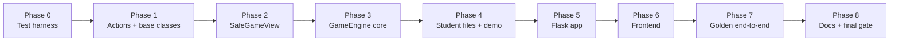

# RogueEdu — Phased Implementation Plan

Target executors: deepseek4-flash / glm5.3-flash (fast, weak models).
Strategy: small tasks, one or two files of context each, **tests-as-spec** (the gate test file is pasted into the task before any implementation), and a hard `make test` gate between phases.

Specification source of truth: [`plans/prompt_v2.md`](prompt_v2.md). This plan adds execution order, per-task gates, and scores.

---

## Scoring method

- **Feasibility** = P(the weak model implements the task correctly within 2 attempts)
- **Confidence** = P(a green gate proves the requirement — tests cannot pass while the feature is broken)

All tasks land at **92 or above** after the simplifications noted in the decision log. Scores assume the task prompt includes the test specification listed here.

---

## Decision log (resolved in review)

| Decision | Outcome |
| --- | --- |
| Gate command | `make test` — 5-line byte-exact [`Makefile`](../Makefile) chaining `pytest -q tests/` then `node --test tests/js/`; T0.1 gate includes a literal `make test` smoke run (TAB-indent gotcha) |
| npm usage | None at runtime. Dev-only `jsdom` (pure JS) for canvas tests; no native `canvas` package |
| Canvas test strategy | Tier B: jsdom + ~30-line stub context that records calls; asserts logic, not pixels |
| Win conditions | Three config modes (`defeat_all`, `reach_goal`, `clear_and_reach_goal`), loud `ValueError` validation with `difflib` suggestions |
| Dead villains | Retained in `villains` list forever (`is_alive() == False`); excluded from rendering/reservation. NEVER purged |
| AttackAction | Directional melee `(dx, dy)`, no damage field; damage from `attacker.attack_power`, sanitized engine-side |
| Demo game | `demos/demo_dungeon/` — worked example + teacher reference; exercised by golden tests; Flask loads config via `GAME_CONFIG_MODULE` env var |
| Naming canon | `x`, `y`, `hp`, `max_hp`, `attack_power`, `goal_pos` — single vocabulary table in prompt_v2 |
| App specifics | `app.secret_key` set; `debug=False`; session UUID → `GAMES` dict; lazy game creation |

---

## Implementation doctrine (how we know it is correct)

1. **Tests-as-spec** — each task prompt contains its gate test's file name and the named assertions below; the model implements until green.
2. **Phase gates** — no phase starts until the previous phase's `make test` is 100% green. Red gate = fix, never proceed.
3. **Golden scenarios (Phase 7) are the final arbiter** — five fully-scripted games assert complete turn-JSON sequences.
4. **One contract fixture** — `tests/fixtures/turn_payload_schema.json` is consumed by BOTH pytest (validates engine output) and the jsdom tests (validates what JS expects). The two sides cannot drift.
5. **Anti-false-green spot checks** — a handful of assertions that a wrong implementation must fail (e.g., villain registration order shuffled → contention test goes red).
6. **Manual visual checklist** — the only honest gate for pixels; written in [`README.md`](../README.md) and executed at Phase 6 exit.

### Phase flow

---

## Phase 0 — Test harness (gate: `make test` exits 0)

| Task | Deliverable | Feas. | Conf. |
| --- | --- | --- | --- |
| T0.1 | Byte-exact [`Makefile`](../Makefile) (TAB-indented, `.PHONY: test`), [`pytest.ini`](../pytest.ini), [`requirements.txt`](../requirements.txt) (flask, pytest), [`.gitignore`](../.gitignore), empty [`tests/`](../tests) with `tests/test_smoke.py` | 98 | 98 |

Gate assertions: `make test` runs `pytest -q tests/` (1 passing smoke test) then `node --test tests/js/` (0 tests, exit 0). Install jsdom: `npm install --save-dev jsdom` (dev-only, pure JS).

---

## Phase 1 — Data layer (gate: `make test` green)

| Task | Deliverable | Gate test — key assertions | Feas. | Conf. |
| --- | --- | --- | --- | --- |
| T1.1 | [`engine/actions.py`](../rogue_edu/engine/actions.py) — frozen dataclasses `Action`, `MoveAction(dx,dy)`, `AttackAction(dx,dy)`, `WaitAction()`, `SpeakAction(message)` | `tests/test_actions.py`: frozen mutation raises; `AttackAction(damage=5)` raises `TypeError` (no such field); defaults/fields exact | 97 | 98 |
| T1.2 | [`GameObject`](../rogue_edu/engine/base_classes.py), [`Character`](../rogue_edu/engine/base_classes.py) (`MAX_HP=200`, `MAX_ATK=40`, clamp→`self.warnings` buffer, `take_damage`, `is_alive`, `calculate_attack_damage` default), [`Wall`](../rogue_edu/engine/base_classes.py) (`symbol() -> "🧱"`), read-only `position` property | `tests/test_character.py`: hp 500 → clamped 200 + warning string; atk -5 → 0 + warning; `take_damage` returns applied amount; `is_alive` at 0 hp False; abstract `GameObject()` raises | 96 | 97 |
| T1.3 | [`Hero`](../rogue_edu/engine/base_classes.py) concrete; [`Villain`](../rogue_edu/engine/base_classes.py) with abstract `act(view)`; [`NPC`](../rogue_edu/engine/base_classes.py) with abstract `interact(view)`, no hp | `tests/test_base_classes.py`: `Villain("G",1,1,10,5)` without `act` subclass raises `TypeError`; concrete subclass instantiates; NPC has no `hp` attribute | 97 | 98 |

---

## Phase 2 — Read-only view (gate: `make test` green)

| Task | Deliverable | Gate test — key assertions | Feas. | Conf. |
| --- | --- | --- | --- | --- |
| T2.1 | [`SafeGameView`](../rogue_edu/engine/view.py) — immutable snapshot; `get_hero_position()`, `distance_to_hero()` (Manhattan), `get_direction_toward_hero()` (normalized, larger-axis first, x-axis tie-break — documented), `is_tile_passable()` | `tests/test_view.py`: mutating a copied snapshot never affects engine; distance hero-at-(3,4) villain-at-(6,4) == 3; direction from (3,3) to hero (5,4) == (1,0) — x tie-break; wall tile impassable | 93 | 94 |
| T2.2 | `__getattr__` typo catcher — **exact 12-line implementation pasted in task**: dunder names raise `AttributeError` immediately; otherwise `difflib.get_close_matches` over a frozen `_PUBLIC_API` tuple; suggestion embedded in message; private engine ref unreachable | `tests/test_view_getattr.py`: `view.hero_pos()` message contains `get_hero_position`; `view.__deepcopy__` raises without recursion; `copy.deepcopy(view)` succeeds; `view._engine` raises with no suggestion leak | 95 | 95 |

---

## Phase 3 — GameEngine core (gate: `make test` green after each task)

| Task | Deliverable | Gate test — key assertions | Feas. | Conf. |
| --- | --- | --- | --- | --- |
| T3.1 | `__init__(width=10, height=10, win_condition="defeat_all", goal_pos=None)`; loud validation (`ValueError` + difflib suggestion; goal modes need `goal_pos` in-bounds, not on wall); `add_hero/add_villain/add_npc/add_wall` drain `warnings` into setup log; villains stored in registration order | `tests/test_engine_init.py`: `win_condition="defeat_al"` message contains `defeat_all`; goal mode without goal_pos raises; goal_pos (15,2) raises; goal_pos on wall raises; clamp warnings land in setup log; `villains[0]` is first registered | 95 | 96 |
| T3.2 | `board_state` builder — exact schema per prompt_v2 §8; dead villains omitted; `goal_pos`/`goal_locked` fields | `tests/test_board_state.py`: schema keys exact match against contract fixture; dead villain absent from `board_state.villains` but present in `engine.villains`; `goal_locked` true only for clear_and_reach with living villains | 95 | 96 |
| T3.3 | Hero input resolution — bump-to-attack, bump-NPC dialogue, wall BLOCKED, passable move, `space` → WaitAction; all events emitted | `tests/test_hero_resolution.py`: one test per branch — attack deals sanitized `attack_power`; NPC bump sets `active_dialogue` + freezes villains; wall bump logs BLOCKED with beginner_text + JSON event; `space` advances turn with no movement | 94 | 95 |
| T3.4a | Villain movement + `reserved_tiles` contention — first claim wins, runner-up BLOCKED at origin | `tests/test_villain_move.py`: two villains targeting same tile — first moves, second stays with BLOCKED event; engine state consistent after | 92 | 93 |
| T3.4b | Villain directional attacks — target `(x+dx, y+dy)`; harms ONLY hero; wall/empty/villain tile → MISSED/BLOCKED, zero damage | `tests/test_villain_attack.py`: villain adjacent → hero hp drops by sanitized damage; attack into wall → MISSED event, hero hp unchanged; attack into another villain → zero damage | 93 | 94 |
| T3.4c | Dead-Actor skip (skip `not is_alive()` with log entry) + hero-death abort (`hp <= 0` mid-phase → `game_over`, remaining villains skipped) | `tests/test_death_rules.py`: scripted doubles — corpse villain skipped with log; lethal villain hit aborts villain 2 of 2; retained-corpse invariant: dead villain still in `engine.villains` | 93 | 94 |
| T3.5 | Full lifecycle with early exits — dialogue pause frame consumes a key without advancing turn; win check after hero action skips villain phase; cleanup clears `reserved_tiles` only | `tests/test_lifecycle.py` (scripted villain doubles): kill-last-villain turn → `won=True`, villains never acted; reach-goal turn → early exit; dialogue dismiss turn → `turn_count` unchanged; win check BEFORE purge uses retained corpses (the clear_and_reach unwinnable-state regression test) | 94 | 95 |
| T3.6 | Event objects — `beginner_text`, `actor`, `action`, `result` in {SUCCESS, BLOCKED, MISSED, WARNING, INFO}, `tile_pos` `[x,y]` or null | `tests/test_events.py`: every event matches contract fixture; blocked wall event has both beginner string and detailed fields; diagonal MoveAction → WaitAction + WARNING event | 93 | 94 |

---

## Phase 4 — Student layer + demo (gate: `make test` green)

| Task | Deliverable | Gate test — key assertions | Feas. | Conf. |
| --- | --- | --- | --- | --- |
| T4.1 | [`student_starter/classes.py`](../rogue_edu/student_starter/classes.py) — docstringed starter Hero/Villain/NPC; constructors take `x, y` and pass to `super().__init__` | `tests/test_starter.py`: passes [`check_my_class.py`](../check_my_class.py) with zero findings; one scripted engine smoke game runs | 96 | 97 |
| T4.2 | [`student_starter/game_config.py`](../rogue_edu/student_starter/game_config.py) — `create_game()` 10x10 map; commented examples of all three win modes | `tests/test_config.py`: returns `GameEngine`; hero exactly one; walls in bounds; all three modes construct without error | 96 | 97 |
| T4.3 | [`check_my_class.py`](../check_my_class.py) — pure function `inspect_classes() -> list[Finding]`; dumb printer; `[PASS]`/`[WARN]`/`[FAIL]` tone per prompt_v2 §9; catches import errors as FAIL hints | `tests/test_checker.py`: good file → zero FAIL findings; fixture `no_act_villain.py` → FAIL mentioning `act`; fixture `returns_none.py` → WARN; fixture `syntax_error.py` → FAIL with hint, NO traceback | 93 | 93 |
| T4.4 | **Demo game** `demos/demo_dungeon/` — `entities.py` (Chaser via `get_direction_toward_hero`, Coward fleeing below half HP, Patroller on fixed legs, Elder NPC), `game_config.py` with `create_game()` using `clear_and_reach_goal`, short `demos/README.md` ("read, don't submit") | `tests/test_demo.py`: boots via `create_game()`; three distinct villain behaviors verified in scripted 10-turn runs (chaser closes distance, coward retreats when hp < half, patroller cycles); counts as golden scenario input for Phase 7 | 95 | 95 |

---

## Phase 5 — Flask app (gate: `make test` green)

| Task | Deliverable | Gate test — key assertions | Feas. | Conf. |
| --- | --- | --- | --- | --- |
| T5.1 | [`app.py`](../app.py) — `GET /`, `POST /api/step`, `POST /api/reset`; `app.secret_key` set; `debug=False`; session UUID → module-level `GAMES` dict; lazy creation for stale sessions; `GAME_CONFIG_MODULE` env loader (default `student_starter.game_config`) | `tests/test_app.py` (Flask test client): `/` 200 + canvas markup; step with `{"key":"d"}` returns full payload matching contract fixture; reset replaces state; second session cookie → independent game; `GAME_CONFIG_MODULE=demos.demo_dungeon.game_config` loads demo | 94 | 95 |

---

## Phase 6 — Frontend (gate: `make test` + manual checklist)

| Task | Deliverable | Gate test — key assertions | Feas. | Conf. |
| --- | --- | --- | --- | --- |
| T6.1 | [`templates/index.html`](../templates/index.html) — Bulma CDN, 10x10 canvas, HUD (turn, hero HP, Villains Remaining = living count), collapsible API Reference Card, dual-view log toggle, event rows with `data-x`/`data-y` | `tests/test_frontend_structure.py`: file contains required element IDs, CDN links, toggle, keydown hint; **plus** the 8-point manual visual checklist in README (includes colored tile borders behind emoji for glyph-portability) | 95 | 92 |
| T6.2 | [`static/game.js`](../static/game.js) pure module — exactly 3 pure functions: `keyToIntent(key)`, `gridToPixel(x,y,cell)`, `highlightBox(tile)`; DOM/canvas code banned here | `tests/js/helpers.test.mjs` (`node --test`): key map w/a/s/d/space exact; grid math cell boundaries; highlight box rect math | 93 | 92 |
| T6.3 | Renderer, WASD listeners, log-to-tile dashed highlighter, game_over input lock — **Tier B**: jsdom page + injected stub context recording calls | `tests/js/renderer.test.mjs`: with contract-fixture payload — hero symbol drawn at hero cell, villains/walls/NPCs drawn, goal 🏆 or 🔒 per `goal_locked`, clicking event row triggers dashed-stroke at `tile_pos`, keydown after `game_over` posts nothing; `npm i -D jsdom` only | 92 | 92 |

---

## Phase 7 — Golden end-to-end (gate: `make test` green)

| Task | Deliverable | Gate test — key assertions | Feas. | Conf. |
| --- | --- | --- | --- | --- |
| T7.1 | `tests/test_golden.py` — five scripted games asserting FULL turn-JSON sequences: (1) arena defeat_all win; (2) maze reach_goal exit-run win; (3) clear_and_reach two-stage win (uses retained-corpses path); (4) hero death loss; (5) dialogue freeze + dismissal cadence | Each golden run: exact `won`/`game_over` per turn, exact event `result` sequences, final payloads match contract fixture; scenario 3 runs against the demo config (keeps demo drift-proof) | 92 | 95 |

---

## Phase 8 — Docs + final gate

| Task | Deliverable | Gate | Feas. | Conf. |
| --- | --- | --- | --- | --- |
| T8.1 | [`README.md`](../README.md) — setup, controls, win modes, student workflow (check → edit → run), demo pointer, **the 8-point manual visual checklist as a formal Phase 6 exit artifact**, Windows note (no native `make`) | `make test` fully green end-to-end; checklist executed and initialed | 98 | 98 |

---

## Model workflow rules (for executing with weak models)

1. One task per conversation turn; the task prompt = spec section + gate test names/assertions from this plan + relevant section of [`plans/prompt_v2.md`](prompt_v2.md). Nothing else.
2. Byte-exact pastes for: [`Makefile`](../Makefile), the T2.2 `__getattr__` implementation, the T6.3 stub-context object.
3. If a gate is red after 2 attempts, shrink the task (split the test file) — do not loosen assertions.
4. Never let the model "improve" the contract fixture; it is frozen after T3.2.

## Total: 21 tasks, 8 gates. Every task ≥ 92 after simplifications.
