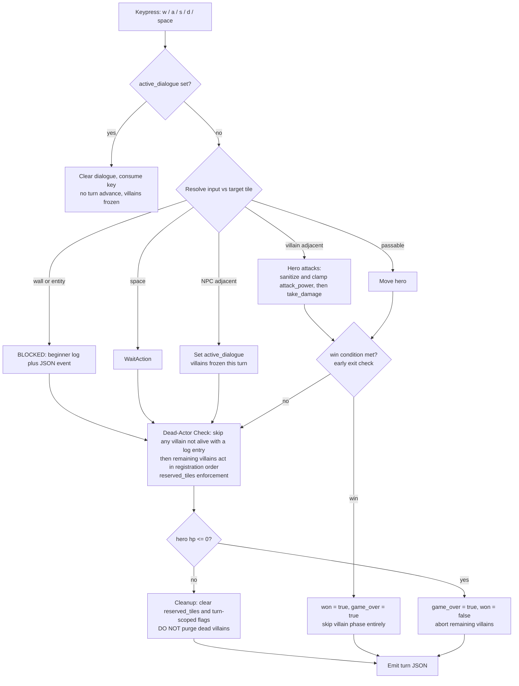

You are a senior Python software engineer and CS curriculum architect. We are building an educational 2D turn-based grid game engine designed to teach Object-Oriented Programming (OOP) to Grade 9 students using Python and Flask.

## Project Overview

Students learn OOP by creating custom subclasses (`Hero`, `Villain`, `NPC`) in a dedicated file and assembling their game in a configuration file. The engine runs authoritative turn logic, provides students with an immutable read-only view of the world (`SafeGameView`), processes intent-based `Action` returns, and streams turn state to a browser running an HTML5 Canvas frontend.

## Canonical Vocabulary — Single Source of Truth

Use these names EXACTLY, everywhere (Python attributes, method names, JSON keys, JS renderer, HTML). Do not invent synonyms.

| Concept | Canonical name | Notes |
| --- | --- | --- |
| Position | `x`, `y` | integers on `GameObject`; also expose read-only `position` property returning `(x, y)` |
| Health | `hp`, `max_hp` | `max_hp` is the clamped ceiling |
| Offense | `attack_power` | canonical name; NEVER `atk`, NEVER `damage` on the instance |
| Bounds | `MAX_HP = 200`, `MAX_ATK = 40` | class constants on `Character` |
| Goal tile | `goal_pos: tuple[int, int] | None` | engine attribute, mirrored in turn JSON |

`atk` and `health` must not appear anywhere in the codebase.

## Core Architectural Rules

1. **Strict Separation of Concerns**
   - `student_starter/classes.py`: Student class blueprints only (subclassing ABCs). No game instantiation, no global world mutations, no hardcoded starting coordinates.
   - `student_starter/game_config.py`: Game composition only, via a `create_game() -> GameEngine` factory function. This is where coordinates, stats, win conditions, and registration order live.

2. **Intent-Based Action Pattern**
   - Entities never mutate state directly. They return an `Action` object: `MoveAction`, `AttackAction`, `WaitAction`, or `SpeakAction`.
   - The engine is the sole authority that applies actions to world state.

3. **Read-Only World Access**
   - Villains and NPCs receive a `SafeGameView` snapshot, never the `GameEngine`. The view must not leak a reference to the engine.

4. **Transparent Failures & Loud Invariants**
   - Never clamp silently. Clamping always emits an explicit warning event into the log.
   - If an action is blocked by a wall, entity, or invalid input, record BOTH a beginner-friendly log string AND a detailed JSON event.

5. **Tech Stack Constraints**
   - Backend: Python 3.10+, Flask.
   - Frontend: Vanilla JavaScript, HTML5 Canvas (10x10 grid), Bulma CSS via CDN.
   - No React, no TypeScript, no bundlers, no npm build steps, no pygame.

## File Structure to Implement

```text
rogue_edu/
├── engine/
│   ├── __init__.py
│   ├── actions.py         # Action base class and concrete Action types
│   ├── base_classes.py    # GameObject, Character(ABC), Hero, Villain, NPC, Wall
│   ├── view.py            # SafeGameView with helper methods & difflib typo catcher
│   └── core.py            # GameEngine, turn loop, stat clamping, collision, turn log
├── student_starter/
│   ├── classes.py         # Clean starter subclasses with docstrings for students
│   └── game_config.py     # create_game() factory function with a 10x10 starter map
├── check_my_class.py      # Student-facing diagnostic script with friendly hints
├── app.py                 # Flask web server running the game session
├── templates/
│   └── index.html         # Bulma UI: Canvas, API Reference Card, Dual-view Turn Log
└── static/
    └── game.js            # Canvas renderer, WASD listeners, log-to-tile highlighter
```

## Component Requirements

### 1. `engine/actions.py`

Define frozen dataclasses:

- `Action` — base dataclass.
- `MoveAction(dx: int, dy: int)` — relative cardinal offset.
- `AttackAction(dx: int, dy: int)` — **directional melee. It carries NO damage value.**
- `WaitAction()` — pass the turn.
- `SpeakAction(message: str)` — dialogue payload.

Critical: `AttackAction` has exactly two fields, `dx` and `dy`. Damage is NEVER part of the action payload. A student writing `AttackAction(damage=500)` must fail with a Python `TypeError`, not be silently tolerated.

### 2. `engine/base_classes.py`

- `GameObject(ABC)`: stores `name`, `x`, `y`. Abstract `symbol() -> str` returning an emoji or sprite identifier. Provides read-only `position` property returning `(x, y)`.
- `Character(GameObject)`: enforces stat bounds at construction via `MAX_HP = 200` and `MAX_ATK = 40`.
  - Clamping is NEVER silent. When `hp`/`max_hp`/`attack_power` are out of range, clamp them AND append a human-readable warning string to a per-instance `self.warnings: list[str]` list. `GameEngine.register_*` methods drain these into the setup log (the engine does not exist at construction time, so instances must buffer their own warnings).
  - `take_damage(amount) -> int` returns actual damage applied. Negative amounts heal in raw math, so the engine MUST sanitize before calling (see Failure Doctrine).
  - `is_alive() -> bool` returns `self.hp > 0`.
  - `calculate_attack_damage() -> int` returns `self.attack_power` by default. Students MAY override it for flavor (crits, etc.), but the engine NEVER trusts its return value — see Failure Doctrine.
- `Hero(Character)`: player-controlled entity with customizable stats and name.
- `Villain(Character)`: adds abstract `act(view: SafeGameView) -> Action`.
- `NPC(GameObject)`: adds abstract `interact(view: SafeGameView) -> SpeakAction`. NPCs have no hp.
- `Wall(GameObject)`: blocks movement, `symbol() -> "🧱"`.

### 3. `engine/view.py`

- `SafeGameView`: immutable read-only snapshot of the board. Built fresh each turn; holds copies, not live references. Must not expose the engine.
- Helper methods:
  - `get_hero_position() -> tuple[int, int]`
  - `distance_to_hero(entity: GameObject) -> int` — strict Manhattan distance: `abs(x1 - x2) + abs(y1 - y2)`. A value of `1` guarantees cardinal adjacency.
  - `get_direction_toward_hero(entity: GameObject) -> tuple[int, int]` — normalized `dx, dy`, each in `{-1, 0, 1}`. Tie-breaking rule: prefer the larger axis delta; on equal deltas prefer the horizontal (x) axis. Document this in the docstring.
  - `is_tile_passable(x: int, y: int) -> bool`
- Implement `__getattr__` using `difflib.get_close_matches` against the public method/attribute list to suggest valid names on typos (e.g. `hero_pos()` suggests `get_hero_position()`). Raise `AttributeError` with the suggestion embedded in the message.
  - **Mandatory guard:** `__getattr__` must immediately `raise AttributeError` for any name starting and ending with `__` (dunder) to prevent infinite recursion from copy/pickle/introspection, and must never return the private engine reference.

### 4. `engine/core.py`

`GameEngine`:

- Attributes: `width=10`, `height=10`, `hero`, `villains`, `npcs`, `walls`, `goal_pos`, `win_condition`, `turn_count`, `logs`, `active_dialogue`, plus a transient `reserved_tiles: set[tuple[int,int]]` used only during a villain phase.
- `__init__` signature: `GameEngine(width=10, height=10, win_condition="defeat_all", goal_pos=None)`.
- `__init__` validation is LOUD — raise `ValueError` with a `difflib`-suggested correction for an unknown `win_condition` (e.g. `"Unknown win_condition 'defeat_al'. Did you mean 'defeat_all'?"`). Also raise if:
  - a goal mode is selected but `goal_pos is None`;
  - `goal_pos` is out of bounds;
  - `goal_pos` coincides with a wall.
- Registration API: `add_hero`, `add_villain`, `add_npc`, `add_wall`. Each drains the object's `self.warnings` into the setup log as explicit warning events. Villains are stored in registration order — this order is the turn resolution order.
- Dead villains are RETAINED in `self.villains` with `is_alive() == False`. They are excluded from `board_state` rendering and from collision/reservation checks, but NEVER purged from the list. Purging them would permanently break `clear_and_reach_goal` win evaluation.

### 5. Turn Lifecycle — Exact Order With Early Exits



Precise rules:

1. **Dialogue pause frame.** If `active_dialogue` is set, ANY input clears it and ends the tick immediately. `turn_count` does not advance and villains do not move.
2. **Hero input resolution (bump-to-attack).** No separate attack mode. The player presses `w`/`a`/`s`/`d`:
   - Target tile holds a living `Villain` → hero stays put and attacks it using the hero's own `attack_power` (sanitized, see Failure Doctrine).
   - Target tile holds an `NPC` → hero stays put, `npc.interact(view)` is called, its `SpeakAction.message` becomes `active_dialogue`, and the villain phase is skipped for this tick.
   - Target tile holds a `Wall` or another entity → `BLOCKED`, no movement.
   - Target tile is passable and empty → hero moves.
   - Key is `space` → `WaitAction` (pass turn). State this explicitly in the docstrings.
3. **Early win exit.** Immediately after the hero's action resolves, evaluate the win condition. On success set `won = True` and `game_over = True` and return the turn payload WITHOUT running the villain phase.
4. **Dead-Actor Check.** Before the villain phase, iterate `self.villains`; any villain with `is_alive() == False` is skipped and logs a beginner-friendly line. Dead villains also occupy no tile.
5. **Villain phase.** Remaining villains act in strict registration order. Each calls `act(view) -> Action`, and the engine applies the returned action with the same sanitization rules as hero actions.
6. **Tile contention.** Track `reserved_tiles` for the duration of the villain phase. The first villain to claim a destination wins; any later villain targeting an already-claimed tile has its move cancelled, logs `BLOCKED: Target tile occupied`, and stays at its origin. The engine re-evaluates each villain's action against the current live state.
7. **Diagonal rejection.** Any `MoveAction` or `AttackAction` whose `abs(dx) + abs(dy) != 1` is illegal. Convert it to `WaitAction` and emit a warning event. Diagonal movement is never permitted; movement is strictly cardinal (N/S/E/W).
8. **Villain attacks.** A villain's `AttackAction(dx, dy)` resolves against the tile at `(villain.x + dx, villain.y + dy)`. It only ever harms the `Hero`. If that tile holds a wall, empty space, or another villain, log `MISSED` or `BLOCKED` and deal zero damage. Villains never damage each other.
9. **Hero death.** If the hero's `hp <= 0` during villain resolution, set `game_over = True`, `won = False`, and abort all remaining villain turns immediately.
10. **Cleanup.** Clear `reserved_tiles` and any turn-scoped flags. Retain dead villains in the list.
11. **Emit turn JSON.**

### 6. Win Conditions

Three config-selected modes, validated loudly in `GameEngine.__init__`:

- `"defeat_all"` — win when there is at least one registered villain AND all villains are not alive. The `len(self.villains) > 0` guard prevents a turn-0 win on an empty map. Dead villains are retained, so this check remains valid after cleanup.
- `"reach_goal"` — win when the hero is on `goal_pos`. `goal_pos` is required.
- `"clear_and_reach_goal"` — win when all villains are not alive AND the hero is on `goal_pos`.

`check_win_condition() -> bool` must be a single readable method. Its fallthrough for an unknown mode must raise `ValueError` (never a silent `return False`), consistent with the loud-invariants doctrine.

### 7. Failure Doctrine — Damage Sanitization

The engine is the sole trust boundary for damage:

- Damage ALWAYS originates from `attacker.attack_power`, never from an action payload.
- Before applying damage, the engine calls `attacker.calculate_attack_damage()`, then sanitizes the result: negative → `0`; greater than `MAX_ATK` → `MAX_ATK`. Every sanitization emits an explicit warning event naming the actor and the offending value. This closes the "override `calculate_attack_damage()` to return 500" and "return a negative number to heal" exploits without forbidding overrides.
- `AttackAction` payload damage remains structurally impossible (no such field).

### 8. Turn JSON Contract

Every `step()` returns one payload; `board_state` is the shared interface between `engine/core.py` and `static/game.js` and must match this shape EXACTLY:

```json
{
  "turn": 4,
  "game_over": false,
  "won": false,
  "win_condition": "clear_and_reach_goal",
  "goal_pos": [9, 9],
  "goal_locked": true,
  "active_dialogue": null,
  "board_state": {
    "width": 10,
    "height": 10,
    "hero": {"name": "Aria", "x": 3, "y": 4, "hp": 18, "max_hp": 20, "symbol": "🦸"},
    "villains": [{"name": "Slime", "x": 5, "y": 5, "hp": 6, "max_hp": 10, "symbol": "👾"}],
    "npcs": [{"name": "Elder", "x": 2, "y": 2, "symbol": "🧙"}],
    "walls": [{"x": 0, "y": 0, "symbol": "🧱"}]
  },
  "events": [
    {
      "beginner_text": "Aria bumped into a wall and could not move north.",
      "actor": "Aria",
      "action": "MoveAction",
      "result": "BLOCKED",
      "tile_pos": [3, 3]
    }
  ]
}
```

- `events[].result` is one of `SUCCESS`, `BLOCKED`, `MISSED`, `WARNING`, `INFO`.
- Every event carries `beginner_text`, `actor`, `action`, `result`, `tile_pos`. `tile_pos` is `[x, y]` or `null` when no tile is implicated.
- Dead villains are omitted from `board_state.villains`.
- `goal_locked` is `true` when `win_condition == "clear_and_reach_goal"` and living villains remain — the frontend renders the goal as `🔒` instead of `🏆`.
- The HUD's "Villains Remaining" counts LIVING villains only.

### 9. `check_my_class.py`

A student-facing diagnostic script that inspects `student_starter/classes.py` and validates:

1. Inheritance from approved base classes.
2. Implementation of required abstract methods (`act`, `interact`, `symbol`).
3. Safe test invocation with a mock `SafeGameView` to confirm `act()` and `interact()` return a valid `Action` instance (and specifically a `SpeakAction` for `interact`).

Output must be humanized terminal feedback using `[PASS]`, `[WARN]`, and `[FAIL]`, each with a concrete suggested fix. Never surface a raw Python traceback. Examples of the expected tone:

- `[FAIL] Your class 'Blob' does not inherit from Villain, NPC, or Hero. Fix: class Blob(Villain):`
- `[FAIL] Villain 'Blob' is missing the act() method. Fix: def act(self, view): return WaitAction()`
- `[WARN] act() returned None instead of an Action. Fix: return MoveAction(1, 0)`
- `[PASS] Villain 'Slime' inherits Villain and act() returns MoveAction(1, 0).`

Also catch and format exceptions raised inside student code as `[FAIL]` lines with the exception message, plus a hint about the likely cause (e.g. an undefined name, a bad import, a wrong argument count).

### 10. `student_starter/classes.py` and `student_starter/game_config.py`

- `classes.py`: clean, heavily docstringed starter subclasses (one `Hero`, one `Villain`, one `NPC`). Constructors accept `x` and `y` and pass them up to `super().__init__(...)`. Subclasses define STATS and BEHAVIOR only — never placement, never coordinates, never game instantiation.
- `game_config.py`: a single `create_game() -> GameEngine` factory. It builds a 10x10 starter map, instantiates the student classes with explicit coordinates, registers them in a deliberate order, sets `win_condition` and `goal_pos`, and returns the engine. Include commented examples of all three win-condition modes.

### 11. `app.py`

- `GET /` renders `templates/index.html`.
- `POST /api/step` accepts `{"key": "w" | "a" | "s" | "d" | "space"}`, advances the turn, and returns the full turn JSON.
- `POST /api/reset` re-instantiates the game via `create_game()` and overwrites that session's entry.

Session handling:

- Set `app.secret_key` explicitly — `flask.session` will not work without it.
- Use `flask.session` to assign a UUID `session_id` cookie.
- Store live engines in a module-level `GAMES: dict[str, GameEngine] = {}`.
- `step` and `reset` look up `GAMES[session["session_id"]]`, lazily creating a game if the session has none (handles a stale cookie).
- Classroom scale is acceptable: unbounded dict growth is fine, but note it in a comment.

### 12. `templates/index.html` and `static/game.js`

Frontend:

- Responsive Bulma CSS layout loaded from CDN.
- A 10x10 HTML5 Canvas rendering grid cells, walls, entities, a goal tile (`🏆` / `🔒`), and per-entity health indicators.
- HUD: turn counter, hero HP, and "Villains Remaining" counting living villains only.
- **API Reference Card:** a collapsible Bulma panel listing exact `SafeGameView` method signatures with one-line examples for each.
- **Dual-View Turn Log:** beginner-friendly text by default, with a toggleable "Developer Inspector" that renders the raw JSON event dictionaries.
- **Log-to-Board Spatial Highlighting:** clicking an event row outlines the referenced `tile_pos` and the named actor on the canvas with a high-contrast dashed box. Events with `tile_pos: null` highlight nothing but still visually select the row.
- WASD listeners plus `space`; keyboard input is disabled while `game_over` is true.

## Non-Goals

- No pygame, no React, no TypeScript, no bundlers, no npm build steps.
- No networking beyond the single Flask process.
- No persistence to disk; games live in memory.

## Deliverable

Generate every file above, completely, with clear instructional docstrings written for a Grade 9 audience. Prioritize correctness of the turn lifecycle and the loud-invariants doctrine over cleverness. If any requirement is ambiguous, choose the simplest behavior consistent with this document and state the assumption in a code comment.
